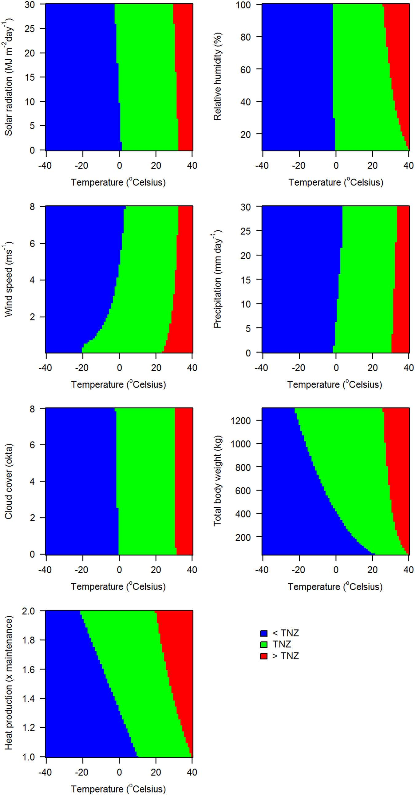
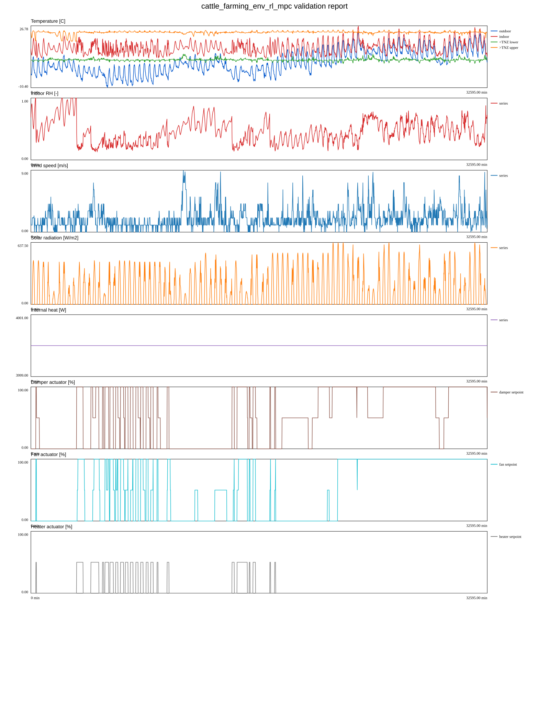

# cattle_farming_env_rl_mpc

`cattle_farming_env_rl_mpc` is a C++ package built on top of the existing [`cattle_climate_simulator_env`](https://github.com/nn44nniri/cattle_climate_simulator_env) library. It adapts the industrial cattle-barn climate simulator into a lightweight MPC-guided reinforcement-learning workflow for cattle thermal-comfort control.

The package is inspired by two references already attached in the workspace:

- the greenhouse RL-based MPC control paper, used as the controller architecture inspiration
- the LiGAPS-Beef thermoregulation / TNZ paper together with `thermoregulation_sensitivity.cpp`, used here to define breed-aware thermal comfort bands through `LCT`, `UCT`, `<TNZ`, and `>TNZ`
This implementation is part of the climate controller in my thesis trans-domain digital twin, which is written in the resources section. This implementation is customized for industrial cattle farming.

Trans-domain digital twin optimization view:


## Abstract

`cattle_farming_env_rl_mpc` is a C++ microservice-oriented climate-control package for cattle sheds that combines a lightweight cattle-barn climate simulator, a simplified breed-aware thermoregulation model, and an MPC-guided reinforcement-learning decision workflow. The package is designed to keep the indoor environment of a cattle shed within the thermal comfort region of the herd while balancing three competing objectives: cattle welfare, body-weight development, and actuator energy use. In the current implementation, the controller uses external climate data, internal climate simulation, optional gRPC-bridge data feeds for live herd weights and sensor measurements, and per-actuator dispatch outputs for dampers, fans, and heaters. The system also supports SQLite-backed event storage, estimator reporting, LiGAPS-Beef optimizer climate summaries, and service-style runtime deployment inside Docker.

The project is motivated by the thermal-neutral-zone formalism described in *LiGAPS-Beef, a mechanistic model to explore potential and feed-limited beef production 2: sensitivity analysis and evaluation of sub-models* and by an RL-based MPC greenhouse-control strategy adapted here to the cattle-barn domain. Instead of reproducing the full original LiGAPS-Beef thermoregulation implementation, the package uses a simplified but configurable breed-registry-based thermoregulation layer whose parameters are loaded from `settings.json`. This enables practical deployment, incremental calibration, and addition of new breeds without modifying the C++ source.

## Introduction

Thermal stress is one of the most important environmental constraints in cattle production systems. A cow that is too cold or too hot must divert energy away from productive biological functions toward thermoregulation. In practice, this means that climate control in a cattle shed is not only an engineering problem, but also a biological one: the optimal indoor climate depends on the genotype, body weight, physiological heat production, humidity, solar load, wind exposure, precipitation, and other factors that shift the boundaries of the animal’s thermal comfort region.

This repository addresses that challenge by turning the cattle shed into a controlled decision environment. The controller continuously evaluates the environment and chooses actuator settings so that the barn climate remains as close as possible to the herd’s optimal thermal comfort interval. The package uses a compact form of predictive decision-making inspired by model predictive control, but instead of a heavy continuous optimization routine it evaluates a discrete set of candidate actuator combinations over a short horizon and selects the best-scoring action under a multi-objective reward.

The implementation is intentionally lightweight. It is meant to be practical, inspectable, configurable, and deployable as a service in Docker. At the same time, it preserves the key conceptual link to the LiGAPS-Beef thermoregulation view of cattle comfort: the temperature range in which a cow is comfortable is not fixed and must be interpreted together with the surrounding climatic context and the animal’s own biological characteristics.

## Problem Statement

The engineering problem solved by this package is: **how can a cattle shed be climate-controlled automatically so that a multi-breed herd remains within its thermally optimal region while minimizing unnecessary actuator energy use and preserving expected body-weight gain?**

This problem has several sub-problems:

1. The herd can contain multiple breeds, and each breed may have different thermal comfort characteristics.
2. The comfort boundaries are not constant; they move with environmental conditions and body weight.
3. Real-time operation requires external interfaces for live herd weights, environmental sensor data, actuator dispatch, estimator reporting, and optimizer queries.
4. Operational data must be logged for later reporting and aggregation.
5. The package must remain lightweight and practical rather than requiring a full-scale high-dimensional optimization framework.

The current package answers these sub-problems with a configuration-driven breed registry, a simplified thermoregulation model, a discrete MPC-style action search, SQLite-backed event storage, and UDS gRPC bridge contracts that allow the controller to exchange data with other services without embedding a full gRPC runtime in the controller binary itself.

## Approach and Answers to Questions

### 1) How is cattle thermal comfort represented?

Thermal comfort is represented through a breed-aware thermal neutral zone (TNZ) bounded by a lower critical temperature (`LCT`) and an upper critical temperature (`UCT`). For each cow or breed group, the controller computes the current comfort interval using body weight, heat-production scaling, wind, humidity, solar radiation, cloud cover, and precipitation. The indoor air temperature is then evaluated against these dynamic bounds.

### 2) How is multi-breed training handled?

Multi-breed training is handled through `training_breed_profiles` in `settings.json`. Each profile defines a breed, a base body weight, daily gain/loss coefficients, and a `cow_count`. During training, one barn state is evaluated against all expanded cows from all profiles, so the learned controller is exposed simultaneously to multiple breed responses.

### 3) How does the controller decide what to do?

The controller generates a small discrete set of candidate actuator actions, predicts their short-horizon consequences, evaluates a reward/cost score, and selects the best-scoring action. The score balances several objectives: staying within TNZ, encouraging body-weight gain, avoiding excess humidity/wind discomfort, reducing energy consumption, and avoiding abrupt actuator changes. This is why the controller is best described as a lightweight MPC-guided RL controller rather than a pure classical MPC or a pure model-free RL system.

### 4) How are real-time weights and sensor data integrated?

The package supports bridge-style gRPC integration through transformation nodes such as `liGAPS-Beef`, `sensors-interface`, `actuators-interface`, `estimator-interface`, and `liGAPS-Beef-optimizer`. In the current implementation, the controller exchanges information through request/response files representing UDS gRPC traffic. This keeps the package lightweight while preserving stable inter-service contracts.

### 5) How are runtime events and reports generated?

All major controller decisions can be stored in SQLite. The event store supports both bounded workflows (`controller_events`) and runtime-service workflows (`realtime_controller_events`). From these tables, the package can generate estimator reports, actuator-energy aggregates, and day/night indoor climate summaries for the LiGAPS-Beef optimizer microservice.

### 6) What is the meaning of Figure 2 in the LiGAPS-Beef article?

Figure 2 is one of the conceptual foundations of this package. It explains that cattle thermal comfort is defined by a **thermal neutral zone (TNZ)** bounded by two thresholds:

- **LCT (Lower Critical Temperature)**: below this, the cow experiences cold stress and must increase heat conservation or metabolic heat production.
- **UCT (Upper Critical Temperature)**: above this, the cow experiences heat stress and must increase heat dissipation.

Cattle thermal comfort:



The figure does **not** describe body temperature directly. It describes how the cow reacts to **ambient environmental temperature** under changing surrounding conditions. In other words, the same indoor air temperature can be comfortable on one day and stressful on another depending on humidity, wind, solar radiation, precipitation, cloud cover, body weight, and heat production.

The green or central comfort region in Figure 2 represents temperatures at which the cow can maintain thermal balance with minimal extra effort. The left region (`<TNZ`) represents cold stress, where environmental heat loss is too high and the animal must spend additional energy to keep warm. The right region (`>TNZ`) represents heat stress, where the environment is too warm or too restrictive for effective heat loss and the animal must spend additional effort to cool down.

The key scientific message of Figure 2 is that the TNZ is **dynamic rather than fixed**. The boundaries move because cattle are not passive thermometers. Their interaction with the environment changes with:

- **solar radiation**: can reduce cold stress by warming the animal, but can also increase heat load in warm conditions;
- **relative humidity**: affects evaporative cooling and therefore shifts upper comfort limits;
- **wind speed**: can increase convective heat loss, making a cow feel colder at the same air temperature;
- **precipitation**: increases wetting and heat loss, especially in cold conditions;
- **cloud cover**: changes radiative heat exchange and modifies solar loading;
- **body weight**: changes body mass and heat storage behavior;
- **heat production**: changes how much internal metabolic heat the animal can contribute to thermal balance.

A simple interpretation is this: suppose a cow appears comfortable between 5°C and 20°C under calm, dry conditions. If wind increases substantially, the same 5°C may no longer be safe because the cow loses heat faster; effectively, `LCT` moves upward. Likewise, if humidity is high and solar load is strong, `UCT` may move downward because the cow has more difficulty losing heat. Therefore, air temperature alone is not sufficient for welfare assessment or control.

This package adopts that exact interpretation. The simplified thermoregulation layer does not treat comfort as a single static threshold. Instead, it computes a moving TNZ interval from breed-dependent base values and climatic modifiers. That is why the controller reward is built around staying within a **dynamic** `LCT`–`UCT` interval rather than a single constant temperature target.

### 7) Why is Figure 2 important for this repository specifically?

Because the controller must decide how to move dampers, fans, and heaters in real time, it needs a target definition of “comfort.” Figure 2 provides that definition conceptually: comfort is the range between dynamic lower and upper critical boundaries. The package translates this into a computational rule that the optimizer can evaluate at each step. This lets the controller act on cattle-centered thermal comfort instead of only barn-centered engineering variables.

## Formalisms

The current package is intentionally lightweight, but it still follows a coherent set of operational formalisms.

### 1) Dynamic TNZ formalism

For a given breed preset and current environment, the controller estimates:

- `LCT = f_breed(weight, wind, humidity, solar, cloud, rain, heat production, body factors)`
- `UCT = g_breed(weight, wind, humidity, solar, cloud, rain, heat production, body factors)`

The exact C++ implementation uses simplified weighted shifts relative to breed base values. The important modeling principle is that `LCT` and `UCT` are **state-dependent** and **breed-dependent**.

### 2) Thermal state classification

Given current indoor air temperature `T_in`, the animal is classified as:

- cold stress if `T_in < LCT`
- thermal comfort if `LCT <= T_in <= UCT`
- heat stress if `T_in > UCT`

### 3) Weight update formalism

The package uses a practical daily rule:

- if within TNZ, body weight is incremented using a positive gain coefficient;
- if outside TNZ, body weight is decremented using a loss coefficient.

This is not meant to be a full cattle growth model; it is a lightweight operational proxy for thermoregulation-related performance.

### 4) MPC-guided candidate action search

At each step, the controller evaluates a discrete action set built from actuator levels such as 0%, 50%, and 100% for damper, fan, and heater. For each candidate action, the simulator predicts the next state over a short horizon. The controller then computes a score and chooses the best action.

### 5) Reward / penalty formalism

The score combines:

- positive reward for expected weight gain;
- penalty for distance outside the TNZ interval;
- penalty for excess energy use;
- penalty for humidity discomfort;
- penalty for wind discomfort;
- penalty for abrupt actuator changes.

This makes the problem explicitly multi-objective rather than single-objective.

### 6) Event-store formalism

Each major decision can be recorded as an event containing:

- timestamp;
- operation mode;
- actuator commands;
- per-actuator and total energy consumption;
- predicted reward;
- herd summary;
- indoor and outdoor climate variables;
- TNZ lower and upper bounds.

SQLite then becomes the source for estimator reporting and date-based optimizer summaries.

## Results

The package currently provides a functional research-and-engineering workflow rather than a benchmark paper with final field results. Its main results are software and systems results:

1. **A working multi-breed cattle climate controller** with configurable breed presets and grouped herd training.
2. **A dynamic TNZ-based decision criterion** grounded in the LiGAPS-Beef comfort interpretation.
3. **A lightweight MPC-guided RL loop** suitable for deployment and testing.
4. **Validation outputs** in CSV and multi-layer SVG form for auditing controller behavior.
5. **SQLite-backed reporting** for energy and indoor-climate aggregation.
6. **A service-style deployment mode** in Docker with request/response bridge interfaces.

In practical terms, the package is already able to:

- train on historical climate data;
- validate control behavior over a selected date window;
- operate in service mode with live bridge inputs;
- provide per-actuator energy summaries;
- answer date-based indoor climate queries for the LiGAPS-Beef optimizer.

The most important scientific result embodied in the software is the operationalization of Figure 2’s message: thermal comfort must be controlled as a **dynamic environmental-biological interval**, not as a fixed barn temperature.

## References

This repository is based conceptually on the following core sources already referenced throughout the package and conversation history:

1. **A. van der Linden et al. ,(2018), LiGAPS-Beef, a mechanistic model to explore potential and feed-limited beef production 2: sensitivity analysis and evaluation of sub-models.https://doi.org/10.1017/S1751731118001738** This is the thermoregulation reference used for the TNZ interpretation, the role of `LCT` and `UCT`, and the importance of climatic and animal modifiers of thermal comfort.
2. **S. Mallick et al. , (2025), Reinforcement learning-based model predictive control for greenhouse climate control. https://doi.org/10.1016/j.atech.2024.100751** This is the architectural inspiration for the lightweight MPC-guided RL decision pattern adapted here from greenhouse climate control to cattle-shed climate control.
3. The local source implementation files in this repository, especially:
   - `thermal_comfort.*`
   - `rl_mpc.*`
   - `transformation.*`
   - `event_store.*`
   - `weather_dataset.*`

4. **Mansoorali Amiri, (2025), Towards intelligent digital twins in agriculture in controlled environments: joint contributions in fruit detection by vision and Trans-domain simulation. https://doi.org/10.71781/310**

These references are complemented by the repository’s own practical implementation choices, which prioritize deployability, configurability, and reproducible operational workflows.

## What this package does

The controller tries to keep the cattle-barn indoor climate close to the cow comfort region while balancing actuator effort and body-weight change rules.

### Controlled actuators

- dampers
- fans
- heaters

### Rewarded behavior

- positive body-weight change under thermal comfort
- indoor temperature remaining within the breed-aware TNZ band
- low energy use / low actuator effort

### Penalized behavior

- thermal stress below `LCT` or above `UCT`
- negative body-weight change under thermal discomfort
- excessive actuator use and abrupt actuator changes

Based on the explanation given and the output graph of one day below, the comfort range of cows is not linear with respect to their genotype and breed and varies with respect to other vital parameters such as humidity, wind, light and weight. This agent in our reinforcement learning has been trained by looking at the past 10 years of climate records to maintain the temperature in the optimal range using the actuators of the hall environment with minimal energy consumption:




## Important design note

This implementation is intentionally practical and lightweight. It is not a full reproduction of the original greenhouse paper’s exact second-order LSTD-Q-learning formulation, and it does not reproduce the full LiGAPS-Beef thermoregulation model one-to-one.

It provides a robust starter with:

- an MPC-style look-ahead action search over actuator candidates
- online reward-weight adaptation during training
- breed-aware TNZ bounds driven by weather and body weight
- multi-breed herd training in one controller
- dataset-driven `train` / `validate` commands
- validation CSV + multi-layer SVG reporting
- datetime-based dataset windows for both training and validation
- an optional gRPC-fed herd-weight bridge through a JSON snapshot exported by the latest gRPC response

## Folder structure

- `include/cattle_climate/` public headers
- `src/` implementation files
- `config/settings.json` main project configuration
- `config/test_settings.json` safe short-step test configuration
- `config/grpc_weight_feed_snapshot.json` example gRPC bridge snapshot
- `dataset/` weather dataset for Alvand
- `models/` saved controller model JSON
- `output/` validation CSV and SVG reports

## Main new modules

- `weather_dataset.*`
  - loads the Alvand climate CSV
  - extracts hourly temperature, humidity, wind, precipitation, cloud cover
  - generates simple solar-radiation estimates used by the controller

- `thermal_comfort.*`
  - defines breed presets
  - computes `LCT` and `UCT`
  - classifies climate into `<TNZ`, `TNZ`, `>TNZ`

- `rl_mpc.*`
  - loads project-level settings
  - trains a lightweight MPC-RL controller
  - validates the saved controller
  - supports multi-breed herd training
  - optionally consumes the latest herd-weight snapshot produced by a gRPC bridge
  - writes CSV and SVG rollout reports

- `rl_mpc_main.cpp`
  - command-line interface with `train` and `validate`

## Configuration

The main settings live in `config/settings.json`.

The training and validation date windows are configured only with datetime strings in the form `YYYY-MM-DD HH:MM:SS`.

### Key sections

- `room`
- `climate`
- `internal_loads`
- `actuator_settings`
- `simulation`
- `cattle`
- `training_breed_profiles`
- `training`
- `validation`
- `reward_weights`
- `grpc_weight_feed`

### Breed presets currently included

- `charolais`
- `boran`
- `brahman_shorthorn`

All breed base values now come from `breed_presets` in `config/settings.json`. You can calibrate existing breeds or add new breeds by appending a new object to this array.

## Multi-breed training

The package can now train one controller against a herd containing multiple breeds at the same time.

Use `training_breed_profiles` in `config/settings.json`:

```json
"training_breed_profiles": [
  {
    "cow_id": "charolais_group",
    "breed": "charolais",
    "cow_count": 8,
    "initial_body_weight_kg": 450.0,
    "gain_when_comfortable_kg_per_day": 0.10,
    "loss_when_stressed_kg_per_day": 0.08
  },
  {
    "cow_id": "boran_group",
    "breed": "boran",
    "cow_count": 6,
    "initial_body_weight_kg": 380.0,
    "gain_when_comfortable_kg_per_day": 0.09,
    "loss_when_stressed_kg_per_day": 0.07
  }
]
```

Each profile describes a breed group in the hall. `cow_count` expands that profile into multiple cows during training, so one run can expose the controller to several breeds simultaneously.

If `training_breed_profiles` is omitted, the package falls back to the single default `cattle` object.

During training, the controller evaluates one shared barn state against all configured herd members and updates one saved controller model.

## Body-weight update modes

Validation supports three practical modes:

1. **automatic**
   - weight changes are computed internally from whether each cow is inside or outside TNZ

2. **manual file**
   - a manual weight file can be provided
   - blank lines are ignored
   - `#` comments are allowed
   - each numeric line is treated as the next daily measured mean body weight

3. **gRPC bridge snapshot**
   - an external gRPC client fetches the latest herd weights
   - that client writes the latest response to a local JSON snapshot file
   - `cattle_farming_env_rl_mpc` reads the record whose `effective_datetime` is the latest one not later than the current control datetime

Example manual weight file:

```text
# daily measured mean herd weights in kg
450.2
450.4
450.1
449.9
```

## gRPC weight-feed integration

### Why a bridge snapshot is used here

This package does not link directly to a gRPC C++ runtime in the current lightweight build. Instead, the runtime contract is kept stable through a JSON snapshot written by an external gRPC bridge process.

That means:

- your production service can query the real gRPC endpoint
- it writes the latest response into `snapshot_json_path`
- this controller reads that file online during validation or deployment control loops

This keeps the current package lightweight while preserving the gRPC data contract in the configuration and README.

### Settings for gRPC access

Example in `config/settings.json`:

```json
"grpc_weight_feed": {
  "enabled": true,
  "endpoint": "localhost:50051",
  "service": "cattle.weights.WeightFeedService",
  "method": "GetLatestHerdSnapshot",
  "snapshot_json_path": "config/grpc_weight_feed_snapshot.json",
  "request_timeout_ms": 2000
}
```

### Required data format to be received from gRPC

The recommended logical response structure is:

```json
{
  "records": [
    {
      "effective_datetime": "2023-01-01 00:00:00",
      "cows": [
        {
          "cow_id": "charolais_real_001",
          "breed": "charolais",
          "body_weight_kg": 452.5,
          "gain_when_comfortable_kg_per_day": 0.10,
          "loss_when_stressed_kg_per_day": 0.08
        },
        {
          "cow_id": "boran_real_014",
          "breed": "boran",
          "body_weight_kg": 386.0,
          "gain_when_comfortable_kg_per_day": 0.09,
          "loss_when_stressed_kg_per_day": 0.07
        }
      ]
    }
  ]
}
```

### Meaning of each field

- `records`
  - ordered set of dated herd snapshots
- `effective_datetime`
  - the datetime from which this snapshot is valid
- `cows`
  - the herd state visible at that date
- `cow_id`
  - unique animal code
- `breed`
  - one of the supported breed preset names
- `body_weight_kg`
  - latest measured body weight in kilograms
- `gain_when_comfortable_kg_per_day`
  - optional per-cow positive daily gain used by automatic TNZ updates
- `loss_when_stressed_kg_per_day`
  - optional per-cow negative daily change used by automatic TNZ updates

### How the controller uses the gRPC-fed data

At each control datetime:

1. the controller reads the current weather row from the Alvand dataset
2. it checks `grpc_weight_feed.snapshot_json_path`
3. it selects the latest herd record whose `effective_datetime` is not later than the current datetime
4. it updates the active herd members by `cow_id`
5. it computes one actuator decision that best serves the whole herd

If no matching gRPC snapshot is found, the controller falls back to the herd defined in `cattle` / `training_breed_profiles`.

## Build

```bash
cmake -S . -B build
cmake --build build
```

## Run tests

```bash
ctest --test-dir build --output-on-failure
```

## Train

```bash
./build/cattle_farming_env_rl_mpc train --settings config/settings.json
```

Training prints episode progress and writes the controller model to:

```text
models/cattle_farming_env_rl_mpc_model.json
```

The saved model now stores:

- the default breed
- the list of trained breeds
- the learned reward weights
- the horizon length
- the fallback daily body-weight rule

## Validate

Automatic TNZ body-weight update:

```bash
./build/cattle_farming_env_rl_mpc validate --settings config/settings.json
```

Manual body-weight update:

```bash
./build/cattle_farming_env_rl_mpc validate \
  --settings config/settings.json \
  --auto-weight false \
  --manual-weight-file manual_weights.txt
```

Validation using the gRPC bridge snapshot:

```bash
./build/cattle_farming_env_rl_mpc validate --settings config/settings.json
```

with `grpc_weight_feed.enabled` set to `true` and `snapshot_json_path` pointing to the latest JSON exported by the external gRPC bridge.

Custom dataset window and output paths:

```bash
./build/cattle_farming_env_rl_mpc validate \
  --settings config/settings.json \
  --start-datetime "2023-01-01 00:00:00" \
  --end-datetime "2023-03-31 23:00:00" \
  --csv output/custom_validation.csv \
  --svg output/custom_validation.svg
```

## Validation outputs

Validation writes:

- a CSV rollout table
- a multi-layer SVG report

The SVG includes:

- outdoor and indoor temperature
- TNZ lower and upper bounds (`LCT`, `UCT`)
- indoor relative humidity
- outdoor wind speed
- solar radiation
- internal heat generated
- actuator commands for damper, fan, heater

The validation CSV now also includes the active herd size and the mean herd body weight used by the controller.

## Default project windows

- training: `2013-01-01 00:00:00` to `2022-12-31 23:00:00` (10 years)
- validation / calibration accuracy interval: `2023-01-01 00:00:00` to `2023-03-31 23:00:00` (3 months)
- automatic TNZ weight update during validation: enabled

## Real-world reuse of the trained model

After training, the controller is saved to `models/cattle_farming_env_rl_mpc_model.json`.
This file is the deployable controller artifact that can be loaded later by the `validate` command or by a future real-time barn-control executable.

In a real deployment loop, a separate service can:

- query the gRPC weight service
- refresh `snapshot_json_path`
- let the controller read the herd state for the current datetime
- apply the selected actuator commands to the barn hardware


## Transformation layer (`transformation.cpp`)

All UDS-based gRPC bridge contracts are centralized in `src/transformation.cpp` and `include/cattle_climate/transformation.hpp`.

This module keeps the rest of the controller unchanged and provides three transport-facing responsibilities:

- request/response contract for **liGRAPS-Beef** weight retrieval
- request/response contract for **sensors-interface** sensor-frame retrieval
- actuator-dispatch output contract for **actuators-interface**

The current package keeps the build lightweight by using a **UDS gRPC bridge file contract**:

- a separate microservice bridge performs the actual protobuf / gRPC over Unix Domain Socket transport
- that bridge writes the latest responses to local JSON snapshots compatible with the proto3 messages
- `cattle_farming_env_rl_mpc` reads those snapshots and writes the actuator-dispatch payload back out

The proto3 contract is documented in:

- `proto/cattle_farming_transformation.proto`

## New CLI modes

### Validation with simulated LiGAPS-Beef herd weights

Use `--simulat-weights` during validation to request and consume the latest herd weights for the current control date through the LiGAPS-Beef bridge node.

```bash
./build/cattle_farming_env_rl_mpc validate   --settings config/settings.json   --model models/cattle_farming_env_rl_mpc_model.json   --simulat-weights
```

Behavior:

- the validation loop keeps using the weather dataset for the selected validation range
- for each control datetime, the optimizer requests the latest herd weights for that date from `liGRAPS-Beef`
- the returned herd replaces the local weight state for decision-making and TNZ evaluation

### Real operation with real herd weights and real sensors

Use `operate --real-weights` after training.

```bash
./build/cattle_farming_env_rl_mpc operate   --settings config/settings.json   --model models/cattle_farming_env_rl_mpc_model.json   --start-datetime "2023-01-01 00:00:00"   --end-datetime "2023-01-01 05:00:00"   --real-weights
```

Behavior:

- the optimizer requests the latest herd weights from `liGRAPS-Beef`
- it reads the latest sensor frame from `sensors-interface`
- it computes the actuator decision using the trained controller
- it writes the resulting actuator command to `actuators-interface`

## Settings for UDS gRPC nodes

Example `transformation` section in `config/settings.json`:

```json
"transformation": {
  "ligaps_beef_weights": {
    "enabled": true,
    "endpoint": "unix:///tmp/ligaps-beef.sock",
    "service": "cattle.farming.transformation.v1.LiGAPSBeefWeightService",
    "method": "GetLatestWeightsByDate",
    "request_timeout_ms": "2000",
    "request_json_path": "config/ligaps_beef_request.json",
    "response_json_path": "config/grpc_weight_feed_snapshot.json"
  },
  "sensors_interface": {
    "enabled": true,
    "endpoint": "unix:///tmp/sensors-interface.sock",
    "service": "cattle.farming.transformation.v1.SensorsInterfaceService",
    "method": "GetLatestSensorFrame",
    "request_timeout_ms": "2000",
    "request_json_path": "config/sensors_interface_request.json",
    "response_json_path": "config/sensors_interface_snapshot.json"
  },
  "actuators_interface": {
    "enabled": true,
    "endpoint": "unix:///tmp/actuators-interface.sock",
    "service": "cattle.farming.transformation.v1.ActuatorsInterfaceService",
    "method": "PushActuatorDispatch",
    "request_timeout_ms": "2000",
    "request_json_path": "config/actuators_interface_request.json",
    "response_json_path": "output/actuators_dispatch.json"
  }
}
```

## gRPC request/response data contracts

### 1) `liGRAPS-Beef` node

Request fields:

- `node_name`: fixed node identifier, usually `liGRAPS-Beef`
- `current_datetime`: the controller datetime for which the latest herd weights are requested

Example logical request:

```json
{
  "node_name": "liGRAPS-Beef",
  "current_datetime": "2023-01-01 00:00:00"
}
```

Response fields:

- `records`: dated herd snapshots
- `effective_datetime`: date from which the snapshot is valid
- `cows`: herd members visible at that date
- `cow_id`: unique code of the cow
- `breed`: breed preset used by the optimizer
- `body_weight_kg`: last available measured weight
- `gain_when_comfortable_kg_per_day`: optional automatic-gain rule
- `loss_when_stressed_kg_per_day`: optional automatic-loss rule

Example logical response:

```json
{
  "records": [
    {
      "effective_datetime": "2023-01-01 00:00:00",
      "cows": [
        {
          "cow_id": "charolais_real_001",
          "breed": "charolais",
          "body_weight_kg": 452.5,
          "gain_when_comfortable_kg_per_day": 0.10,
          "loss_when_stressed_kg_per_day": 0.08
        }
      ]
    }
  ]
}
```

### 2) `sensors-interface` node

Request fields:

- `node_name`: fixed node identifier, usually `sensors-interface`
- `current_datetime`: controller datetime for the sensor frame

Example logical request:

```json
{
  "node_name": "sensors-interface",
  "current_datetime": "2023-01-01 00:00:00"
}
```

Response fields:

- `records`: dated sensor frames
- `effective_datetime`: date from which the frame is valid
- `outdoor_temp_c`
- `relative_humidity`
- `wind_speed_m_s`
- `direct_radiation_w_m2`
- `diffuse_radiation_w_m2`
- `precipitation_mm`
- `cloud_cover_fraction`

Example logical response:

```json
{
  "records": [
    {
      "effective_datetime": "2023-01-01 00:00:00",
      "outdoor_temp_c": 4.0,
      "relative_humidity": 0.58,
      "wind_speed_m_s": 1.7,
      "direct_radiation_w_m2": 0.0,
      "diffuse_radiation_w_m2": 0.0,
      "precipitation_mm": 0.0,
      "cloud_cover_fraction": 0.50
    }
  ]
}
```

### 3) `actuators-interface` node

Request fields written by the optimizer:

- `effective_datetime`
- `predicted_reward`
- `mean_body_weight_kg`
- `herd_size`
- `lct_c`
- `uct_c`
- `action.damper_percent`
- `action.fan_percent`
- `action.heater_percent`

Example logical actuator-dispatch payload:

```json
{
  "transport": "uds-grpc-bridge",
  "endpoint": "unix:///tmp/actuators-interface.sock",
  "service": "cattle.farming.transformation.v1.ActuatorsInterfaceService",
  "method": "PushActuatorDispatch",
  "effective_datetime": "2023-01-01 00:00:00",
  "predicted_reward": 12.4,
  "mean_body_weight_kg": 418.3,
  "herd_size": 3,
  "lct_c": 4.6,
  "uct_c": 21.1,
  "action": {
    "damper_percent": 0.0,
    "fan_percent": 50.0,
    "heater_percent": 0.0
  }
}
```

## Training with multiple breeds simultaneously

The training loop already supports a mixed herd through `training_breed_profiles`. All configured breeds are active at the same time in one shared barn state, so the trained model becomes familiar with the response of different genotypes during one training run.

Example:

```bash
./build/cattle_farming_env_rl_mpc train --settings config/settings.json
```

The trained model remains saved in:

```text
models/cattle_farming_env_rl_mpc_model.json
```

## Tests

Run the full tests:

```bash
cd build
ctest --output-on-failure
```

Included tests now cover:

- base random environment smoke test
- transformation bridge parsing for weight snapshots
- transformation bridge parsing for sensor snapshots
- actuator-dispatch write path


## Offline UDS gRPC bridge tests

This package now includes dedicated offline tests for each bridge node and for the proto3 contract. These tests do not require a live gRPC runtime. They validate the request and response files used by the bridge layer and confirm that the actuator dispatch payload is generated correctly.

Covered offline tests:
- `cattle_climate_ligaps_beef_offline_test`: validates the LiGAPS-Beef request contract and herd-weight response snapshots
- `cattle_climate_sensors_interface_offline_test`: validates the sensors-interface request contract and sensor-frame response snapshots
- `cattle_climate_actuators_interface_offline_test`: validates the actuators-interface request contract and generated actuator dispatch payload
- `cattle_climate_proto_contract_offline_test`: validates the expected proto3 services, RPC names, and key field numbers

Run all tests with:

```bash
ctest --test-dir build --output-on-failure
```

## Breed preset format in settings.json

Each entry in `breed_presets` is fully editable and extensible:

```json
{
  "name": "charolais",
  "lct_ref_c": 5.0,
  "uct_ref_c": 20.0,
  "optimal_relative_humidity_min": 0.45,
  "optimal_relative_humidity_max": 0.75,
  "optimal_wind_min_m_s": 0.10,
  "optimal_wind_max_m_s": 2.20,
  "heat_production_factor": 1.00,
  "coat_reflectivity": 0.60,
  "coat_depth_m": 0.012,
  "area_factor": 1.00,
  "cbsmax": 64.1,
  "lasmax_a": 3.08,
  "lasmax_b": 1.73,
  "rbcsf": 1.00,
  "reference_skin_temp_c": 35.3,
  "metabolic_multiplier": 1.00
}
```

The simplified TNZ module still uses a lightweight decision formula, but its breed-dependent base values now come from `settings.json` instead of being hard-coded in C++.

## Real-time training progress

The `train` command now prints a continuously updating progress bar with current episode, completed steps, running reward, comfort error, energy use, mean body weight, and herd size. This keeps the controller-training feedback visible during long dataset runs.

## SQLite-backed event logging and estimator-interface

This package now stores controller decisions and climate-control events in a SQLite database before generating estimator reports.

### Event store

`config/settings.json` includes:

```json
"event_store": {
  "sqlite_path": "output/cattle_farming_env_rl_mpc.sqlite"
}
```

Each controller step written by `train`, `validate`, and `operate` is stored in `controller_events` with:
- event datetime
- mode (`train`, `validate`, `operate`)
- actuator setpoints
- per-actuator energy use (`damper_energy_kwh`, `fan_energy_kwh`, `heater_energy_kwh`)
- total energy use
- predicted reward
- mean body weight and herd size
- indoor/outdoor state values
- TNZ lower and upper bounds

### New UDS gRPC node: estimator-interface

The transformation layer now supports a fourth node:
- `estimator-interface`

It is configured in `config/settings.json`:

```json
"transformation": {
  "estimator_interface": {
    "enabled": false,
    "endpoint": "unix:///tmp/estimator-interface.sock",
    "service": "cattle.farming.transformation.v1.EstimatorInterfaceService",
    "method": "PushEnergyAggregateReport",
    "request_timeout_ms": "2000",
    "request_json_path": "config/estimator_interface_request.json",
    "response_json_path": "output/estimator_energy_report.json"
  }
}
```

### Request format expected from estimator-interface

The bridge request file is:
- `config/estimator_interface_request.json`

Expected content:

```json
{
  "node_name": "estimator-interface",
  "start_datetime": "2023-01-01 00:00:00",
  "end_datetime": "2023-01-01 23:59:59",
  "interval_minutes": 60,
  "mode_filter": "validate"
}
```

Fields:
- `node_name`: must identify the estimator node
- `start_datetime`: report window start
- `end_datetime`: report window end
- `interval_minutes`: aggregation bucket size in minutes
- `mode_filter`: optional mode filter such as `train`, `validate`, or `operate`; use empty string for all modes

### Aggregated response sent to estimator-interface

The generated bridge response contains one row per time bucket and reports all actuators separately:
- `damper_energy_kwh`
- `fan_energy_kwh`
- `heater_energy_kwh`
- `total_energy_kwh`

Example structure:

```json
{
  "transport": "uds-grpc-bridge",
  "endpoint": "unix:///tmp/estimator-interface.sock",
  "service": "cattle.farming.transformation.v1.EstimatorInterfaceService",
  "method": "PushEnergyAggregateReport",
  "request_window": {
    "start_datetime": "2023-01-01 00:00:00",
    "end_datetime": "2023-01-01 23:59:59",
    "interval_minutes": 60,
    "mode_filter": "validate"
  },
  "response": {
    "generated_at": "2023-01-01 23:59:59",
    "source_sqlite_path": "output/cattle_farming_env_rl_mpc.sqlite",
    "rows": [
      {
        "interval_start": "2023-01-01 00:00:00",
        "interval_end": "2023-01-01 01:00:00",
        "decision_count": 4,
        "damper_energy_kwh": 0.10,
        "fan_energy_kwh": 0.20,
        "heater_energy_kwh": 1.40,
        "total_energy_kwh": 1.70,
        "mean_body_weight_kg": 447.3,
        "mean_indoor_temp_c": 17.8
      }
    ]
  }
}
```

### Command to generate the estimator report

After `train`, `validate`, or `operate` have written events into SQLite, generate the filtered time-based aggregate report with:

```bash
./build/cattle_farming_env_rl_mpc estimator-report \
  --settings config/settings.json \
  --start-datetime "2023-01-01 00:00:00" \
  --end-datetime "2023-01-07 23:59:59" \
  --interval-minutes 60 \
  --mode validate \
  --output output/estimator_energy_report.json
```

If `--start-datetime`, `--end-datetime`, or `--mode` are omitted, the command can fall back to the values in `config/estimator_interface_request.json`.

### Added offline tests

Offline tests now cover:
- LiGAPS-Beef request/response bridge
- sensors-interface request/response bridge
- actuators-interface dispatch bridge
- estimator-interface request/response bridge
- proto3 contract structure
- SQLite aggregate query correctness

Run all tests with:

```bash
ctest --test-dir build --output-on-failure
```


## LiGAPS-Beef optimizer indoor climate response

The `ligaps-climate-report` command serves a date-based UDS gRPC bridge response for the `liGAPS-Beef` optimizer microservice. The response is generated from the SQLite event store and groups indoor climate averages into two periods for the requested calendar date:

- `day`: 06:00:00 to 17:59:59
- `night`: 18:00:00 to 05:59:59

Returned climate averages are:

- `mean_indoor_temp_c`
- `mean_indoor_relative_humidity`
- `mean_indoor_airflow_m3_s`
- `mean_internal_heat_generated_w`

Example:

```bash
./build/cattle_farming_env_rl_mpc ligaps-climate-report \
  --settings config/settings.json \
  --date "2023-01-01" \
  --mode validate
```

The request bridge file is `config/ligaps_beef_optimizer_request.json` and the response bridge file is `output/ligaps_beef_optimizer_climate_report.json`.


## Real-time service mode

Run the controller as a quiet real-time service:

```bash
./build/cattle_farming_env_rl_mpc service --settings config/settings.json --mode run
```

Request stop from another shell or `docker exec` session:

```bash
./build/cattle_farming_env_rl_mpc service --settings config/settings.json --mode stop
```

Notes:
- `service --mode run` does not write logs or JSON files into `output/`.
- Runtime bridge JSON artifacts are written under `/tmp/cattle_farming_env_rl_mpc_service/` instead.
- Runtime decisions are stored in the dedicated SQLite table `realtime_controller_events`.
- For Docker, run the container detached and stop it with `docker exec <container> ./build/cattle_farming_env_rl_mpc service --settings config/settings.json --mode stop`.

Example:

```bash
docker build -t cattle-farming-env-rl-mpc .
docker run -d --name cattle-farming-env-rl-mpc \
  -v "$PWD/output:/opt/cattle_farming_env_rl_mpc/output" \
  -v "$PWD/config:/opt/cattle_farming_env_rl_mpc/config" \
  cattle-farming-env-rl-mpc \
  service --settings config/settings.json --mode run

docker exec cattle-farming-env-rl-mpc \
  ./build/cattle_farming_env_rl_mpc service --settings config/settings.json --mode stop
```